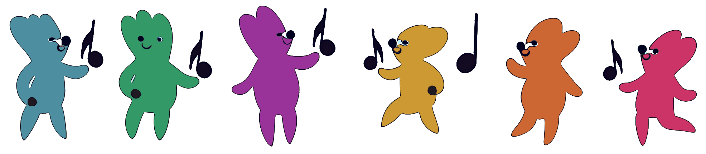

# Pitch Olympics

⭐ Star us on GitHub — it motivates us a lot!

## Introduction

[Pitch Olympics](https://pitcholympics.vercel.app/en) is a website designed to enhance pitch recognition and musical skills, featuring two games: Memo The Melo and Pitch Catch.

## Table of Contents

-   [The "Memo The Melo" game](#the-memo-the-melo-game)
-   [The "Pitch Catch" game](#the-pitch-catch-game)
-   [Contributers](#contributers)

## The "Memo The Melo" game

In Memo The Melo, the goal is to practice quickly memorizing melodies. At each level, you must recall a melody composed of notes added one at a time. With each step, you need to remember all the previous notes, including the new one. Successfully recalling all the notes leads to winning the level.

## The "Pitch Catch" game

Pitch Catch aims to improve your ability to identify pitches. You listen to a pitch and then choose the correct one from several options. Winning the levels requires accurately recognizing all the pitches.

## Contributers

Here are our amazing team:

<a href="https://github.com/HaleviAmit" target="_blank" style="display: flex; flex-direction: column; justify-content: center; align-items: center">
<label>Amit Halevi</label>

</a>

<a href="https://github.com/IradDoron" target="_blank" style="display: flex; flex-direction: column; justify-content: center; align-items: center">
<label>Irad Doron</label>

</a>

<a href="https://github.com/pelegsch666" target="_blank" style="display: flex; flex-direction: column; justify-content: center; align-items: center">
<label>Peleg Mazuz</label>

</a>

<a href="https://github.com/galeindor" target="_blank" style="display: flex; flex-direction: column; justify-content: center; align-items: center">
<label>Gal Ein Dor</label>

</a>

<a href="https://github.com/asafl14" target="_blank" style="display: flex; flex-direction: column; justify-content: center; align-items: center">
<label>Asaf Levi</label>

</a>

